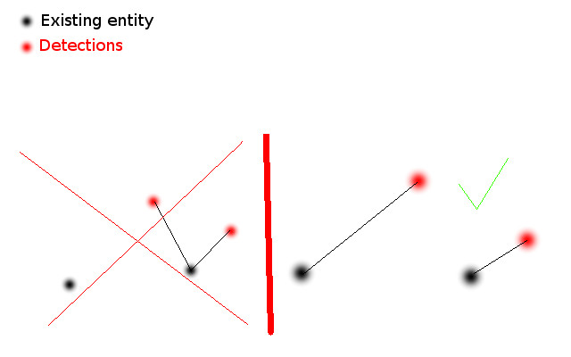

# RealTimeEntityTracking

Projet perso pour explorer le fonctionnement des kalman filters.

Le but final de ce projet est de l'implémenter au projet Sara de Walking Machine.

# wm_entity_tracker

## Description

Node permettant d'aglomèrer les diférentes entrées de détections (ex: bounding boxes3D, leg_detections, face detection)
pour en faire le tracking des entitées.
Cette node utilise entre autre des kalman filters pour faire la prédiction et la filtration.
Un algoritme d'assignation personnalisé permet de faire la liaison entre chaques entrées de perceptions et les entitées connues. 
# 

Testé pour fonctionner avec [ROS] kinetic et Ubuntu 16.04. Le code risque de changer à certain moments.
La licence du code source est [MIT license](LICENSE).

**Auteur(s): Philippe La Madeleine
Mainteneur: Philippe La Madeleine  
Affiliation: Club étudiant Walking Machine, ÉTS**

## Installation

### Buildé de la source

#### Dépendances

- [Robot Operating System (ROS)](http://wiki.ros.org) (middleware pour la robotique),
- [sara_msg](https://github.com/WalkingMachine/sara_msgs) (repo pour les messages utilisé par sara),
- [people](https://github.com/WalkingMachine/people)
- [Open_cv] (vision artificielle)

#### Building

Pour build de la source, clonez la dernière version de ce repo dans votre workspace et compilez avec

	cd <your_workspace>/src
	git clone git@github.com:WalkingMachine/wm_entity_tracker.git
	cd ../
	catkin_make

## Utilisation

Lancer le launchfile avec

	roslaunch wm_entity_tracker wm_entity_tracker.launch

## Nodes

### entity_tracker

La node de tracking pour les entitées.

#### Topics Souscris*

* **`/darknet_ros/bounding_boxes3D`** ([sensor_msgs/Image])

	Les boites 3D retournées par la détection visuelle.

* **`/people_tracker_measurements`** ([darknet_ros_msgs/BoundingBoxes])

	Les paires de jambes détecté par people

#### Topics Publiés*

* **`/frame_to_box/bounding_boxes`** ([wm_entity_tracker/BoundingBoxes3D])

	Les boites 3d obtenues

#### Service
Pas de services en ce moment

#### Paramètres

gen.add("", double_t, 0,   "A double parameter",                               .5,     0,   1)
gen.add("", double_t, 0,      "Maximum possible difference to merge entities.",   1,     0,   1000)
gen.add("", double_t, 0,              "The importance given to XY coordinates",           1,      0,   10)
gen.add("", double_t, 0,               "The importance given to Z coordinate",             0.5,    0,   10)
gen.add("", double_t, 0,     "The importance given to the confidence level",     0.01,    0,   10)

gen.add("", double_t, 0,        "A kalman filter parameter",    0.001,  0.00000001, 1.0)
gen.add("", double_t, 0,    "A kalman filter parameter",    50,     0.001,     100)
gen.add("", double_t, 0,           "A kalman filter parameter",    0.9,    0.001,     1)

gen.add("legs_input_processNoiseCov", double_t, 0,        "A kalman filter parameter",    0.000001,  0.00000001, 1.0)
gen.add("legs_input_measurementNoiseCov", double_t, 0,    "A kalman filter parameter",    10,     0.001,     100)
gen.add("legs_input_errorCovPost", double_t, 0,           "A kalman filter parameter",    0.1,    0.001,     1)

##### Publisher
* **`publication_threshold`** (float, default: 0.5)

	Le niveau de confience minimum pour publier les entitées.
	
##### Input/entity assotiations
* **`weights_XY`** (float, default: 1.0)

	Poid assotié à la distance sur le plan cartésien X/Y.

* **`weights_Z`** (float, default: 0.5)

	Poid assotié à la distance sur l'axe Z.
	
* **`weights_probability`** (float, default: 0.01)

	Poid associé au niveau de probabilité d'existance d'une entitée.
	
* **`maximum_difference`** (float, default: 1.0)

	Taux de diférance maximum pour permettre l'association entre l'entrée de donée et une entitée connue.

##### bounding_boxes3D
* **`bounding_boxes_input_processNoiseCov`** (float, default: 0.001)

	Paramètre du filtre de kalman pour les bounding boxes. // TODO: expliquer fonctionnement
	
* **`bounding_boxes_input_measurementNoiseCov`** (float, default: 50)

	Paramètre du filtre de kalman pour les bounding boxes. // TODO: expliquer fonctionnement
	
* **`bounding_boxes_input_errorCovPost`** (float, default: 0.9)

	Paramètre du filtre de kalman pour les bounding boxes. // TODO: expliquer fonctionnement

##### leg input
* **`bounding_boxes_input_processNoiseCov`** (float, default: 0.001)

	Paramètre du filtre de kalman pour les bounding boxes. // TODO: expliquer fonctionnement
	
* **`bounding_boxes_input_measurementNoiseCov`** (float, default: 50)

	Paramètre du filtre de kalman pour les bounding boxes. // TODO: expliquer fonctionnement
	
* **`bounding_boxes_input_errorCovPost`** (float, default: 0.9)

	Paramètre du filtre de kalman pour les bounding boxes. // TODO: expliquer fonctionnement

[ROS]: http://www.ros.org
[rviz]: http://wiki.ros.org/rviz
[opencv]: http://wiki.ros.org/opencv3
[readme template]: https://github.com/ethz-asl/ros_best_practices/blob/master/ros_package_template/README.md
